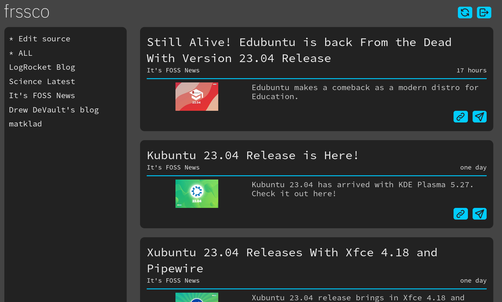

# frssco

A dead-simple self-hostable RSS aggregator written in Deno.



## Features

- database-less (sqlite inside docker container)
- built-in cookie auth
- custom sharing button
- manage feed list as a plain text
- add feed on the client side
- (But you cannot delete feed. Just update `feed.txt` on your server)
- No automatically aggreagation. To aggregate all the feeds, press the update
  button on the top-right, or
  `curl -X POST https://{YOUR_SITE_BASE_URL}/api/refresh`. Setting `cron` on
  your server to post http request would be enough as well.

## Deploy

1. `git clone` this repo.

2. Add `/feed.txt`, `/.env` and `./islands/CustomShare.tsx`.

3. `sudo docker run -d -v ./feed.txt:/app/feed.txt -p 8080:8080 $(sudo docker build -q .)`\
   You may need to remove `deno.lock` from the root.

```
# feed.txt (Lines prefixed with # are ignored)
https://news.itsfoss.com/latest/rss/
...
```

```
# .env
USERNAME=user_name
PASSWORD=password
```

```ts
// /islands/CustomShare.tsx

import IconSend from "https://deno.land/x/tabler_icons_tsx@0.0.3/tsx/send.tsx";
import IconDots from "https://deno.land/x/tabler_icons_tsx@0.0.3/tsx/dots.tsx";
import toastr from "https://esm.sh/toastr";
import { Feedback } from "../types/types.ts";
import { useState } from "https://esm.sh/preact@10.13.1/hooks";

export default function CustomShare(props: { target: string }) {
  const ShareButton = () => {
    switch (state) {
      case Feedback.Init:
        return <IconSend />;
      case Feedback.Loading:
        return <IconDots />;
      case Feedback.Error:
        return <IconSend />;
    }
  };

  const [state, setState] = useState(Feedback.Init);
  const send = async () => {
    setState(() => Feedback.Loading);
    const res = await fetch("https:/example.com/", {
      method: "POST",
      headers: {
        "Content-Type": "application/json",
        Authorization: "YOUR_TOKEN",
      },
      body: JSON.stringify({ url: props.target }),
    });
    setState(() => Feedback.Init);
    toastr.options.positionClass = "toast-bottom-right";
    if (!res.ok) {
      toastr.error(`Cannot share URL: ${props.target}`);
    } else {
      toastr.info(`URL shared: ${props.target}`);
    }
  };

  return (
    <>
      <button onClick={send}>
        <ShareButton />
      </button>
    </>
  );
}
```

## Why

I just wanted to add custom sharing feature to this kind of app.
